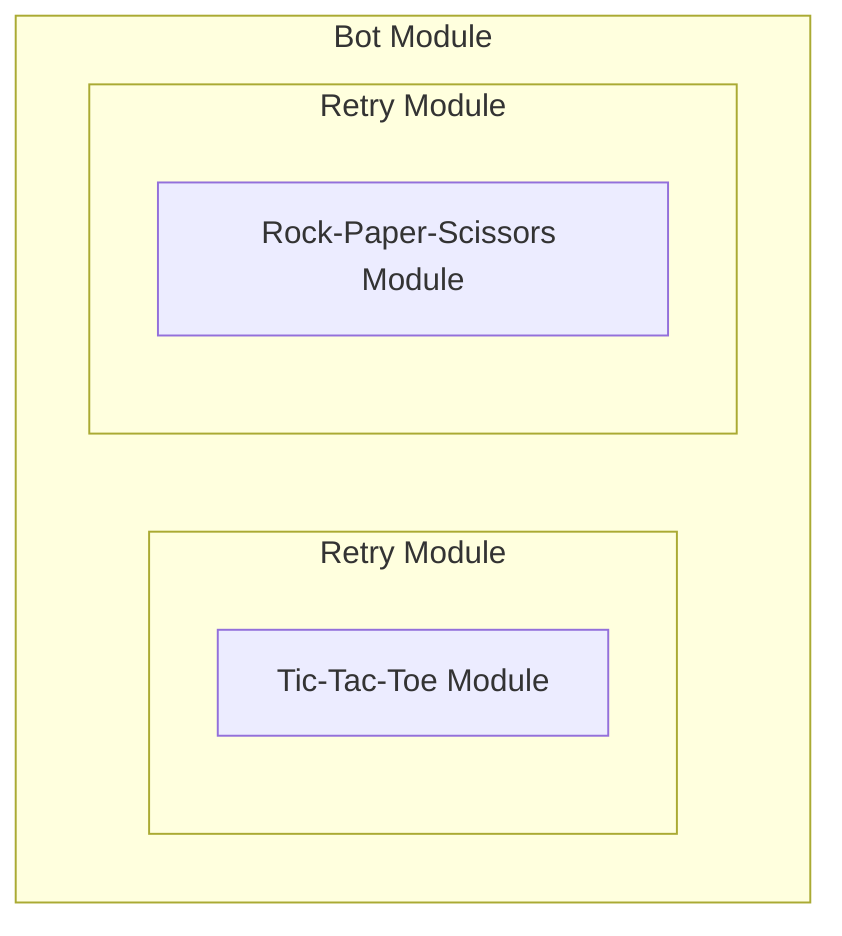

# lowdie

A modular, scalable and internationalized game bot that enables multiple games to be played through
a unified core, supporting new games and interaction channels via simple interface implementations
without altering the core logic.

## About

Here's Lowdie (pronounced low as in "low temperature" + dee as in the letter D):


It can play rock-paper-scissors and tic-tac-toe. It's learning how to play Battleship.

## Overview

There are two main abstractions on the project: modules and interaction channels.

### Module

Every functionality of the bot is represented by a module, which has no internal state.
The bot itself is a module, as well as its games and additional functionality (such as retry).



A module is driven by states and events, just like a [bloc](https://bloclibrary.dev/bloc-concepts/#bloc).

A **state** can be anything the implementer chooses, but it must obey three rules:

- It must be an object
- It must have a `string` property named `type`
- It must have a final state where by `type` is equal to "done"

An **event** has no specific rules, so it can be anything (although it is recommended for it to also be an object 
with a `string` property named `type`, so that you can do exhaustiveness checking when implementing a module).

A module implementer must be able to answer three questions:

- How to obtain the module's initial state?
- Given a state `s` and an event `e`, what should be the module's next state?
- Given a state `s`, what events should be available for the user to emit?

The last question can be answered by instantiating an **action**. There are two types of actions:

- The **select action** has a list of events that the user can choose from (multiple choice).
  For example, when selecting a move in a rock-paper-scissors game, the user can only choose three options ("rock", "paper" or "scissors"). 
- The **input action** parses a text sent by the user into an event (open ended). For example, when selecting a position on a
  Battleship game, the user would typically input the column + row as a text rather than choosing from a long list.

#### Game modules

When implementing a new game, there are three places you can put your implementation:

- _domain/entities_: declares the base models the game uses
- _domain/services_: declares the game logic based on the declared entities
- _application/use-cases/modules_: declares the game module based on the declared logic

For example, the rock-paper-scissors module declares the previous implementations as follows:

- _domain/entities_: a `Move` type as `"rock" | "paper" | "scissors"`
- _domain/services_: a `evaluateGame(botMove: Move, userMove: Move): GameResult` function, which tells who would win in a match
- _application/use-cases/modules_: a module with states `waitingForUser` and `done`, and events `userChose`

#### Wrapping modules

Unlike the game modules, whose implementations are self-contained, the wrapping modules' implementation depends on another module's implementation.

There are currenlty two wrapping modules: the bot module (which receives a list of modules for the user to choose) and the retry module 
(which receives a single module).

For example, the retry module answers the previous questions as follows:

- Its initial state is `active` and contain the wrapped module's initial state
- Given
  - an `active` state and an event `e`, if the wrapped module's next state when `e` is applied is a `done` state, the next state should be `waiting`. Otherwise, it should be kept as `active`
  - a `waiting` state and a `continue` event, the next state should be `active` and containing the wrapped module's initial state (the retry feature)
  - a `waiting` state and a `break` event, the next state should be `done`
- Given
  - an `active` state, the action should be the same as the wrapped module's action for its current state
  - a `waiting` state, the action should be `select` with two events: `continue` and `break`

### Interaction channel

TBA
 
## Installation

It's required to have [Node](https://nodejs.org/en/download) installed in your machine.

1. Clone the repository:

```shell
git clone https://github.com/ezgrs/lowdie
cd lowdie
```

2. Install the dependencies:

```shell
npm install
```

## Usage

### CLI

Run the `cli` script to interact with the bot and follow the on-screen instructions.

```shell
npm run cli
```

### Telegram

#### As a client

Interact with the bot by sending `/start` to [@lowdiebot](https://t.me/lowdiebot) (currently offline).

#### As a host

1. Create a new bot by sending `/start` to [@botfather](https://t.me/botfather):

```text
> /newbot
Alright, a new bot. How are we going to call it? Please choose a name for your bot.
> Lowdie
Good. Now let's choose a username for your bot. It must end in `bot`. Like this, for example: TetrisBot or tetris_bot.
> lowdiebot
Done! Congratulations on your new bot. You will find it at t.me/lowdiebot. You can now add a description, about section and profile picture for your bot, see /help for a list of commands. By the way, when you've finished creating your cool bot, ping our Bot Support if you want a better username for it. Just make sure the bot is fully operational before you do this.

Use this token to access the HTTP API:
9999999999:ZZZZZZZZZZZZZZZZZZZZZZZZZZZZZZZZZ
Keep your token secure and store it safely, it can be used by anyone to control your bot.

For a description of the Bot API, see this page: https://core.telegram.org/bots/api
```

2. Save the token as an environment variable named `TELEGRAM_BOT_TOKEN` (or declare it on a .env on the project's root).

3. Run the `telegram` script to keep the bot active:

```shell
npm run telegram
```
